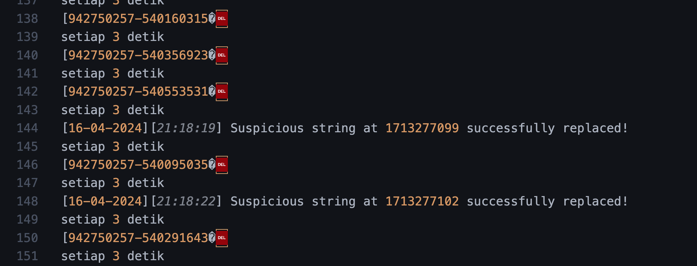
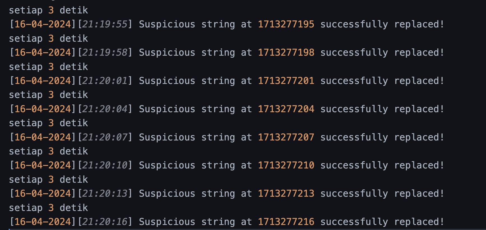
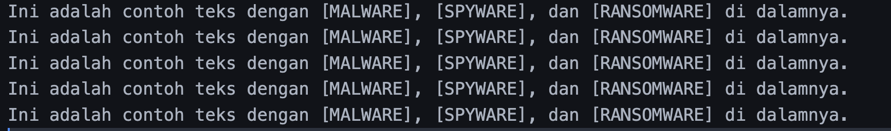
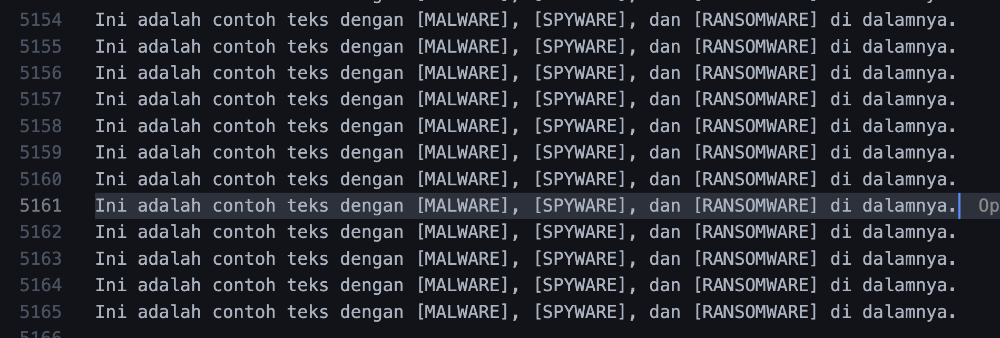
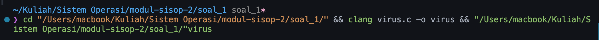
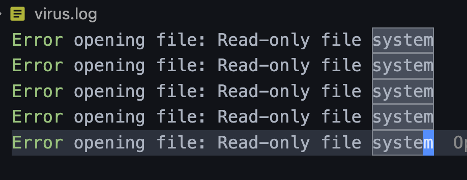

Error timestamp
 
---
Success format time
 
---
Berhasil membuat program untuk mereplace string: 
     
```c
char text[] = "Ini adalah contoh teks dengan m4LwAr3, 5pYw4R3, dan R4nS0mWaR3 di dalamnya.";
```
---
lupa dimatiin sampe 5000an line
 
--- 
gagal log
 

---
 gagal read

---