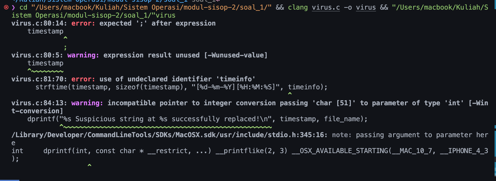

 Success format time
 Berhasil membuat program untuk mereplace string:     
```c
char text[] = "Ini adalah contoh teks dengan m4LwAr3, 5pYw4R3, dan R4nS0mWaR3 di dalamnya.";
```
 lupa dimatiin 



 gagal log

 gagal read