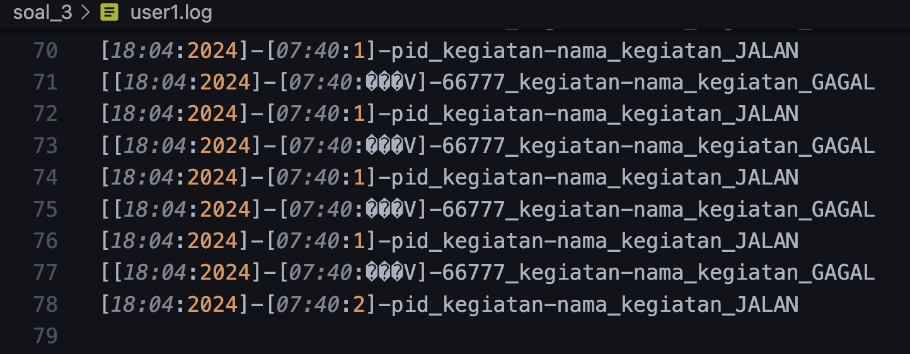
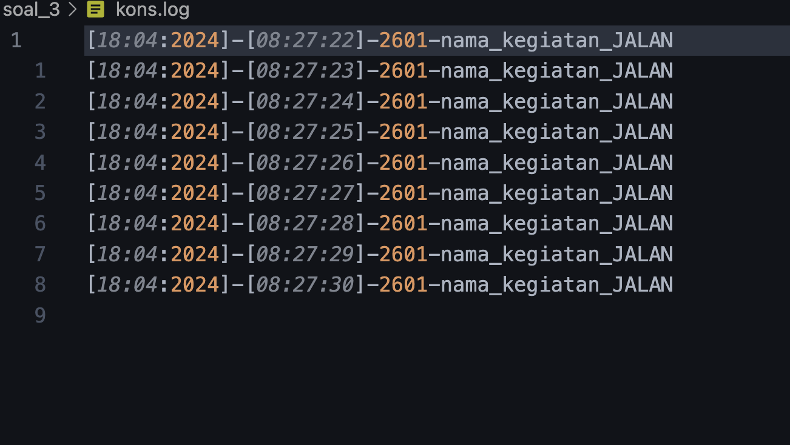
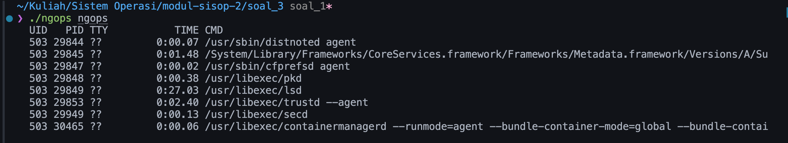
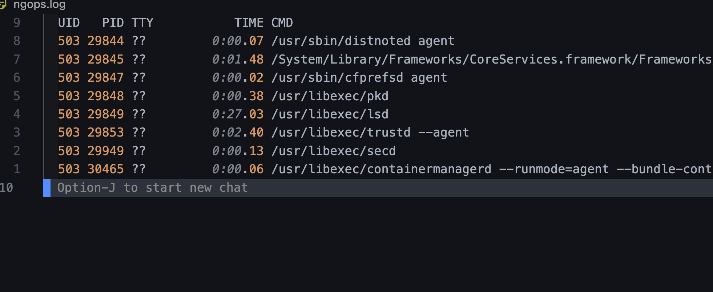
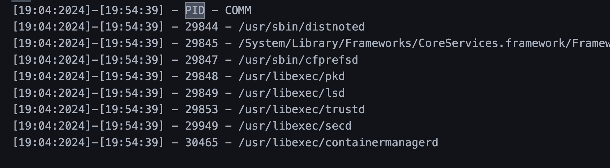
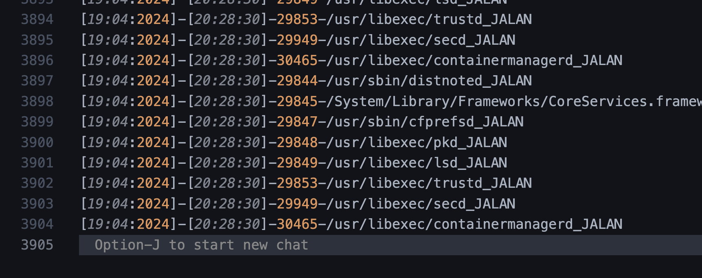
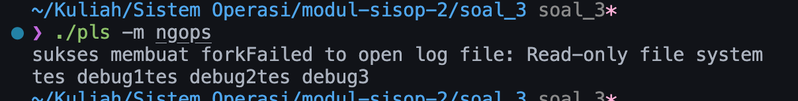

error fitur gagalkan kegiatan user
 
---
pid masih salah tapi timestamp udh bener
 
---
berhasil membuat fitur menampilkan proses user (file ngops.c belum saya 
ubah namanya)

---
salah log, udah bisa log tapi belum di format
 
---
log udah lumayan bener
 
---
log hampir infinite loop (lupa taro sleep())
 
---
error tidak bisa open log file (solusinya hapus chdir(/))
 
